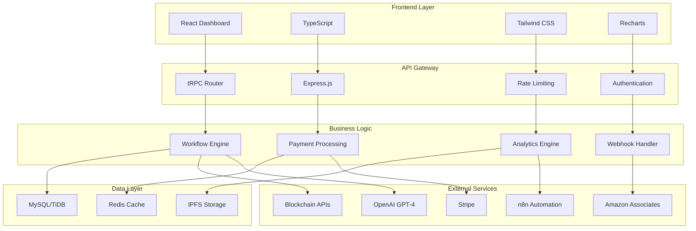
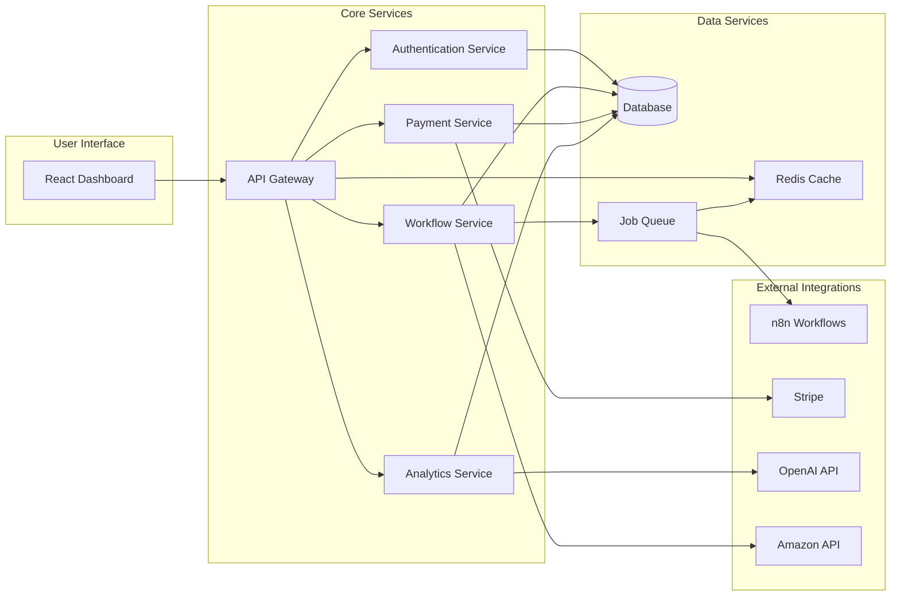
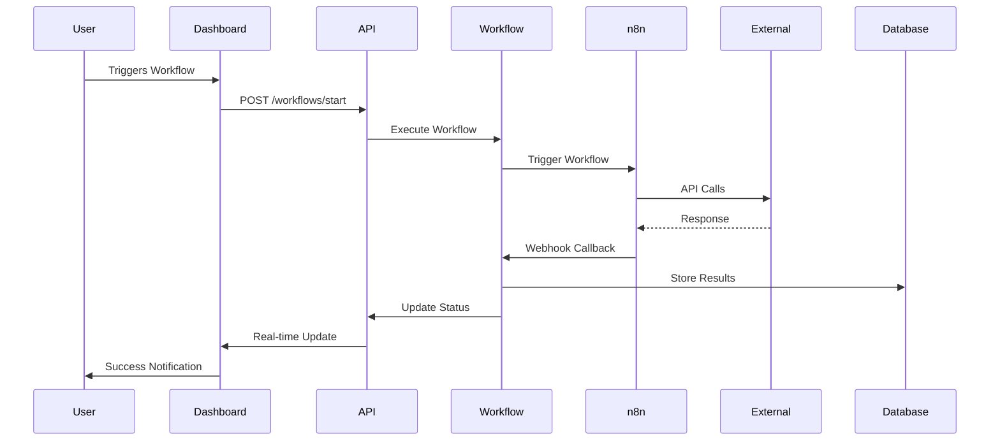
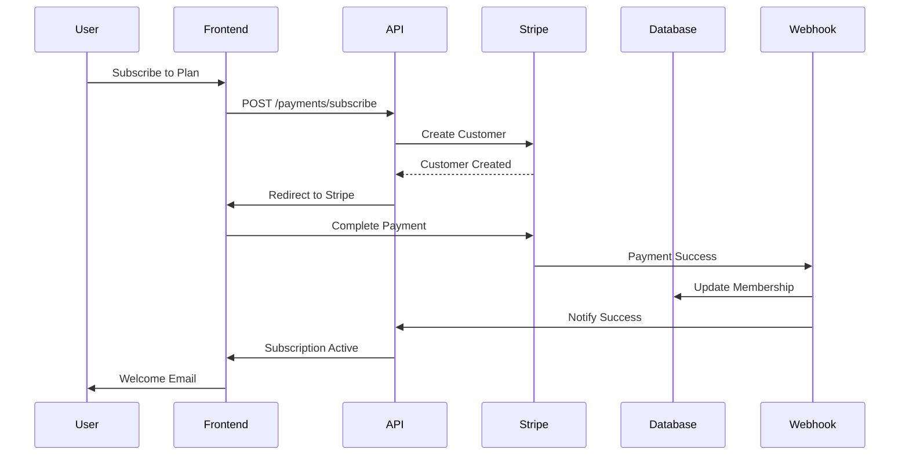
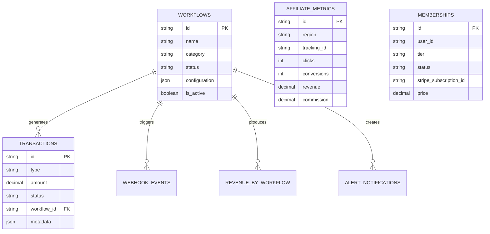
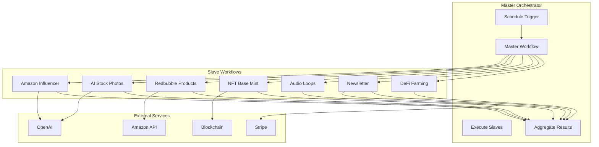
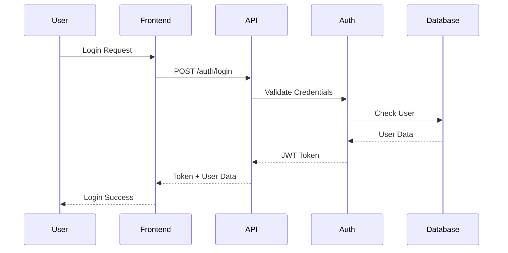
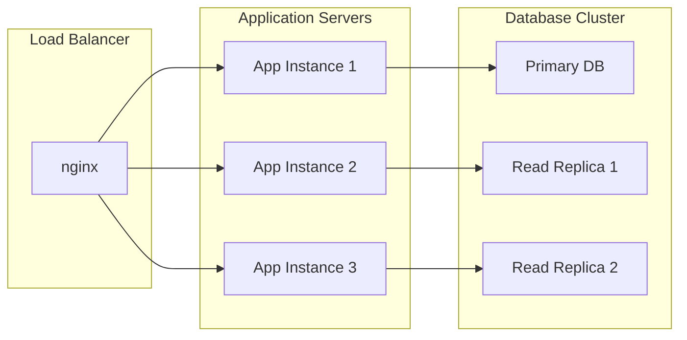
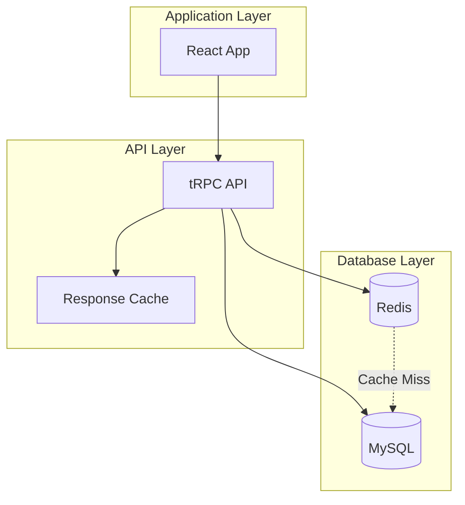
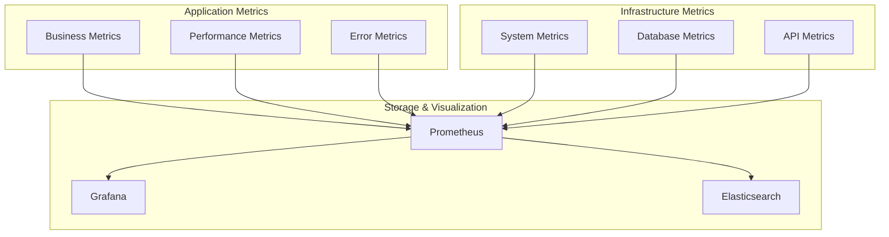

# 🏗️ Architecture Overview

## Table of Contents

- [System Architecture](#system-architecture)
- [Technology Stack](#technology-stack)
- [Data Flow](#data-flow)
- [Database Design](#database-design)
- [API Architecture](#api-architecture)
- [Workflow Automation](#workflow-automation)
- [Security Model](#security-model)
- [Scalability Design](#scalability-design)
- [Performance Optimization](#performance-optimization)
- [Monitoring & Observability](#monitoring--observability)

## System Architecture

### High-Level Overview



### Microservices Architecture



## Technology Stack

### Frontend

| Technology | Purpose | Version |
|------------|---------|---------|
| **React** | UI Framework | 19.0+ |
| **TypeScript** | Type Safety | 5.0+ |
| **Tailwind CSS** | Styling | 4.0+ |
| **Vite** | Build Tool | 5.0+ |
| **tRPC** | API Layer | 11.0+ |
| **React Query** | Data Fetching | 5.0+ |
| **Recharts** | Data Visualization | 2.8+ |
| **React Hook Form** | Form Management | 7.0+ |
| **Zod** | Schema Validation | 3.0+ |

### Backend

| Technology | Purpose | Version |
|------------|---------|---------|
| **Node.js** | Runtime | 18.0+ |
| **Express.js** | Web Framework | 4.0+ |
| **TypeScript** | Language | 5.0+ |
| **tRPC** | API Framework | 11.0+ |
| **Drizzle ORM** | Database ORM | 0.27+ |
| **MySQL** | Primary Database | 8.0+ |
| **Redis** | Caching & Sessions | 7.0+ |
| **JSON Web Tokens** | Authentication | - |
| **Stripe** | Payment Processing | - |
| **Zod** | Validation | 3.0+ |

### Infrastructure

| Technology | Purpose | Version |
|------------|---------|---------|
| **Docker** | Containerization | 24.0+ |
| **Docker Compose** | Orchestration | 2.0+ |
| **nginx** | Reverse Proxy | 1.24+ |
| **n8n** | Workflow Automation | 1.0+ |
| **Prometheus** | Metrics Collection | 2.0+ |
| **Grafana** | Dashboards | 10.0+ |
| **Fluentd** | Log Aggregation | 1.16+ |
| **Elasticsearch** | Log Storage | 8.0+ |

### External APIs

| Service | Purpose | Integration |
|---------|---------|-------------|
| **OpenAI GPT-4** | AI Content Generation | REST API |
| **Stripe** | Payment Processing | Webhooks |
| **Amazon Associates** | Affiliate Tracking | Product API |
| **ElevenLabs** | Voice Generation | REST API |
| **Base Network** | Blockchain Integration | Web3 |
| **Pinata** | IPFS Storage | REST API |
| **Substack** | Newsletter Distribution | API |
| **Bandcamp** | Audio Distribution | API |

## Data Flow

### Workflow Execution Flow



### Payment Processing Flow



## Database Design

### Entity Relationship Diagram



### Database Schema Overview

#### Core Tables

1. **workflows** - Workflow configurations and status
2. **transactions** - All financial transactions
3. **affiliate_metrics** - Amazon affiliate performance
4. **api_usage** - API quota and usage tracking
5. **memberships** - User subscription data
6. **amazon_tracking_ids** - Regional tracking IDs
7. **webhook_events** - n8n webhook logs
8. **revenue_by_workflow** - Financial analytics
9. **platform_connections** - External service tokens
10. **alert_notifications** - System alerts

#### Indexing Strategy

```sql
-- Performance critical indexes
CREATE INDEX idx_workflows_status ON workflows(status);
CREATE INDEX idx_workflows_category ON workflows(category);
CREATE INDEX idx_transactions_workflow ON transactions(workflow_id);
CREATE INDEX idx_transactions_date ON transactions(created_at);
CREATE INDEX idx_affiliate_metrics_region ON affiliate_metrics(region);
CREATE INDEX idx_revenue_workflow_date ON revenue_by_workflow(workflow_id, date);
```

## API Architecture

### tRPC API Structure

```typescript
// API Router Hierarchy
const appRouter = router({
  workflows: workflowRouter,
  transactions: transactionRouter,
  analytics: analyticsRouter,
  membership: membershipRouter,
  affiliates: affiliateRouter,
  webhooks: webhookRouter,
});

// Workflow Router
const workflowRouter = router({
  getAll: publicProcedure.query(getAllWorkflows),
  getById: publicProcedure.input(z.string()).query(getWorkflowById),
  update: protectedProcedure.input(workflowUpdateSchema).mutation(updateWorkflow),
  start: protectedProcedure.input(z.string()).mutation(startWorkflow),
  stop: protectedProcedure.input(z.string()).mutation(stopWorkflow),
  getStats: protectedProcedure.query(getWorkflowStats),
});
```

### API Endpoints

#### Public Endpoints
```
GET  /health                 - Health check
GET  /stats                  - Public statistics
GET  /workflows/public       - Public workflow info
```

#### Protected Endpoints
```
GET  /workflows              - User workflows
POST /workflows/start        - Start workflow
PUT  /workflows/:id          - Update workflow
GET  /transactions           - User transactions
GET  /analytics/revenue      - Revenue analytics
POST /webhooks/n8n           - n8n webhook handler
```

#### Admin Endpoints
```
GET  /admin/metrics          - System metrics
POST /admin/workflows        - Create workflows
PUT  /admin/amazon-tracking  - Update tracking IDs
GET  /admin/users            - User management
```

## Workflow Automation

### n8n Integration Architecture



### Workflow Configuration

```json
{
  "workflows": {
    "amazon_influencer": {
      "schedule": "0 8,16 * * *",
      "timeout": "30m",
      "retryPolicy": {
        "maxRetries": 3,
        "backoff": "exponential"
      },
      "notifications": {
        "onSuccess": true,
        "onFailure": true,
        "webhookUrl": "/api/webhooks/n8n"
      }
    }
  }
}
```

## Security Model

### Authentication Flow



### Security Layers

1. **Network Security**
   - HTTPS/TLS encryption
   - VPN for admin access
   - IP whitelisting for APIs

2. **Application Security**
   - JWT authentication
   - Rate limiting
   - Input validation with Zod
   - SQL injection protection

3. **Data Security**
   - Encrypted database connections
   - PII data encryption
   - Regular security audits

4. **API Security**
   - API key rotation
   - OAuth 2.0 integration
   - Webhook signature verification

## Scalability Design

### Horizontal Scaling



### Caching Strategy



### Database Scaling

1. **Read Replicas**
   - Multiple read replicas for analytics
   - Geographic distribution for latency

2. **Connection Pooling**
   - MySQL connection pool optimization
   - Connection pooling per service

3. **Query Optimization**
   - Query performance monitoring
   - Index optimization
   - Slow query analysis

## Performance Optimization

### Frontend Optimization

```typescript
// React Query for caching
const { data, isLoading } = useQuery({
  queryKey: ['workflows', userId],
  queryFn: () => api.workflows.getAll(),
  staleTime: 5 * 60 * 1000, // 5 minutes
  cacheTime: 10 * 60 * 1000, // 10 minutes
});
```

### Backend Optimization

```typescript
// Database query optimization
const workflows = await db
  .select({
    id: workflows.id,
    name: workflows.name,
    status: workflows.status,
    totalRevenue: sum(transactions.amount)
  })
  .from(workflows)
  .leftJoin(transactions, eq(workflows.id, transactions.workflowId))
  .groupBy(workflows.id)
  .limit(100)
  .execute();
```

### Caching Layers

1. **Browser Cache**
   - Static assets (CSS, JS)
   - Service worker for offline support

2. **CDN Cache**
   - Global content distribution
   - Edge caching for performance

3. **Application Cache**
   - Redis for session data
   - API response caching
   - Database query results

## Monitoring & Observability

### Metrics Collection



### Alerting Rules

```yaml
# Prometheus Alert Rules
groups:
  - name: automation_ecosystem
    rules:
      - alert: WorkflowFailureRate
        expr: rate(workflow_failures_total[5m]) > 0.1
        for: 2m
        labels:
          severity: critical
        annotations:
          summary: "High workflow failure rate detected"
      
      - alert: RevenueDrop
        expr: revenue_24h < revenue_7d_avg * 0.5
        for: 5m
        labels:
          severity: warning
        annotations:
          summary: "Significant revenue drop detected"
```

### Logging Strategy

```typescript
// Structured logging
import winston from 'winston';

const logger = winston.createLogger({
  level: 'info',
  format: winston.format.combine(
    winston.format.timestamp(),
    winston.format.json()
  ),
  transports: [
    new winston.transports.File({ filename: 'error.log', level: 'error' }),
    new winston.transports.File({ filename: 'combined.log' }),
  ],
});
```

This architecture provides a solid foundation for a production-ready automation ecosystem with high performance, scalability, and observability.